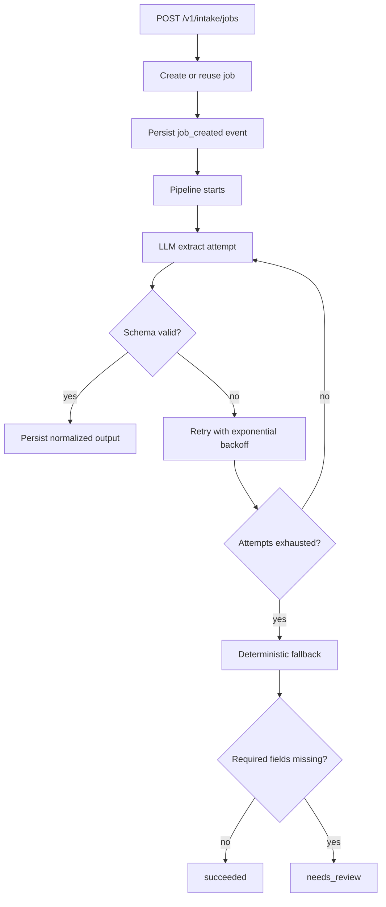

# Reliable LLM Intake

Reliable LLM Intake is a backend-first sample service that turns unstructured text into validated structured output with explicit job states, retries, fallback logic, and an inspectable event trail.

## Why This Exists

This repository is meant to demonstrate production-style AI engineering patterns rather than prompt engineering alone:

- strict schema validation around LLM output
- explicit persisted job states
- retries with exponential backoff
- deterministic fallback when the model cannot fully comply
- test coverage for happy paths and failure paths

## Supported Intake Types

- `resume_intake`
- `support_ticket_intake`

Both flow through the same pipeline and differ only by schema and fallback rules.

## Architecture



## Project Layout

```text
app/
  api/
  core/
  db/
  services/
tests/
docs/
```

Key areas:

- [app/api/routes_jobs.py](/Users/yezi/Documents/reliable-llm-intake/.worktrees/reliable-llm-intake/app/api/routes_jobs.py): create/get intake job routes
- [app/services/pipeline.py](/Users/yezi/Documents/reliable-llm-intake/.worktrees/reliable-llm-intake/app/services/pipeline.py): retry, validation, fallback, ordered trace
- [app/services/fallback.py](/Users/yezi/Documents/reliable-llm-intake/.worktrees/reliable-llm-intake/app/services/fallback.py): deterministic extraction rules
- [app/db/models.py](/Users/yezi/Documents/reliable-llm-intake/.worktrees/reliable-llm-intake/app/db/models.py): persisted jobs and events

## Local Run

Create the virtual environment and install dependencies:

```bash
python3 -m venv .venv
.venv/bin/pip install -e . pytest httpx
```

Run the API locally:

```bash
.venv/bin/uvicorn app.main:app --reload
```

Health check:

```bash
curl http://127.0.0.1:8000/health
```

Expected response:

```json
{"status":"ok"}
```

## API Examples

Create a resume intake job:

```bash
curl -X POST http://127.0.0.1:8000/v1/intake/jobs \
  -H 'Content-Type: application/json' \
  -H 'Idempotency-Key: demo-resume-1' \
  -d '{
    "task_type": "resume_intake",
    "input_text": "Alice Doe is a Python engineer with 5 years of experience. Reach her at alice@example.com."
  }'
```

Fetch a job:

```bash
curl http://127.0.0.1:8000/v1/intake/jobs/<job_id>
```

The response includes:

- terminal status
- attempt count
- normalized result
- ordered event history

## Failure Handling

The pipeline is intentionally explicit about failure modes:

1. Raw model output is parsed as JSON.
2. Parsed output is validated against the task schema.
3. Invalid output records a `validation_failed` event and retries with backoff.
4. After retries are exhausted, deterministic fallback rules try to salvage obvious fields.
5. If critical fields are still missing, the job becomes `needs_review` instead of pretending success.

## Failure Injection Examples

Use the fake client in tests to simulate model problems:

- malformed JSON
- missing required fields
- repeated invalid outputs that trigger fallback
- duplicate idempotency keys that must not create duplicate rows

The pipeline trace test documents the expected state progression.

## Sample Assets

- [docs/sample-resume-input.txt](/Users/yezi/Documents/reliable-llm-intake/.worktrees/reliable-llm-intake/docs/sample-resume-input.txt)
- [docs/sample-ticket-input.txt](/Users/yezi/Documents/reliable-llm-intake/.worktrees/reliable-llm-intake/docs/sample-ticket-input.txt)
- [docs/sample-job-output.json](/Users/yezi/Documents/reliable-llm-intake/.worktrees/reliable-llm-intake/docs/sample-job-output.json)

## Why This Is Portfolio-Ready

This sample maps cleanly to AI engineering job expectations:

- reliable structured extraction instead of demo-only prompting
- backend ownership with API, persistence, and validation
- explicit observability via state and event trail
- deterministic handling for model failure and low-confidence output
- tests that exercise both the happy path and the unhappy path
