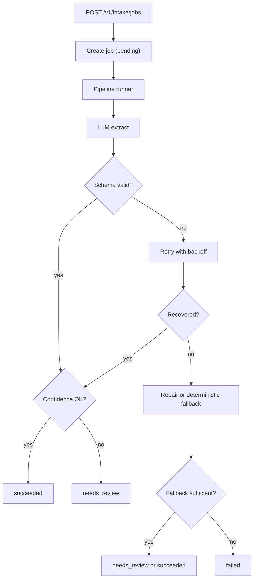

# Reliable LLM Intake Design

## Goal

Build a reusable backend-first sample project that demonstrates production-style LLM pipeline engineering:

- ingest unstructured text
- extract structured JSON
- validate outputs strictly
- retry or repair invalid outputs
- degrade gracefully when confidence is low
- expose explicit job state instead of silent failure

This repository is intended to be a portfolio-quality code sample for AI engineering roles, not a vertical business product.

## Why This Project

Existing projects such as VoiceBridge and CleanCatalyst already demonstrate product delivery and workflow orchestration. This repository should instead prove a narrower and more transferable capability:

- reliable LLM backend design
- pipeline stability under failure
- deterministic validation and fallback
- explicit state transitions
- testable, observable AI flows

## Product Shape

The system is a generic intake service. A caller submits raw text plus a task type. The service returns a job ID immediately, processes the text through a reliable pipeline, and exposes the final normalized result and processing trace.

Supported task types in the MVP:

- `resume_intake`
- `support_ticket_intake`

Both task types share the same pipeline and differ only in schema, prompt, and fallback rules.

## Core User Story

1. Client sends unstructured text to `POST /v1/intake/jobs`.
2. Service creates a job with `pending` state and an idempotency key.
3. Pipeline transitions through `running`.
4. LLM returns structured output.
5. Service validates output with Pydantic and JSON Schema.
6. If validation fails, the service retries with exponential backoff and optional repair.
7. If still not valid, the service falls back to deterministic extraction where possible or marks the job `needs_review`.
8. Final result is stored as `succeeded`, `failed`, or `needs_review`.
9. Client fetches the job and sees both normalized output and processing history.

## Design Principles

- Backend-first: the repository should read like a production service, not a prompt demo.
- Explicit state: every transition must be observable and persisted.
- Deterministic guardrails: validation, retry, fallback, and review thresholds should be code-driven.
- Thin workflow layer: use a small internal state machine first; add a very light workflow abstraction only if it improves clarity.
- Test the unhappy path: malformed JSON, timeout, missing required fields, duplicate requests, and low-confidence output must all be covered.

## MVP Scope

In scope:

- FastAPI API for create/get job
- persistent job table
- idempotent intake creation
- two task schemas
- LLM client abstraction
- strict schema validation
- retry with exponential backoff
- repair pass for malformed output
- deterministic fallback for missing fields
- explicit terminal states
- job event trail
- unit and API tests
- clear README and demo fixtures

Out of scope:

- background queue infrastructure
- websockets
- auth and multi-tenant access control
- real cloud deployment
- UI frontend
- complex planner agents

## Architecture



## Data Model

Primary persisted entity: `intake_jobs`

Suggested fields:

- `id`
- `task_type`
- `idempotency_key`
- `status`
- `input_text`
- `normalized_output`
- `confidence_score`
- `failure_reason`
- `attempt_count`
- `review_required`
- `created_at`
- `updated_at`

Supporting entity: `intake_job_events`

Suggested fields:

- `id`
- `job_id`
- `event_type`
- `event_payload`
- `created_at`

## State Model

Allowed job states:

- `pending`
- `running`
- `succeeded`
- `needs_review`
- `failed`

Allowed event examples:

- `job_created`
- `pipeline_started`
- `llm_attempt_started`
- `llm_attempt_failed`
- `validation_failed`
- `fallback_used`
- `job_succeeded`
- `job_needs_review`
- `job_failed`

## LLM Strategy

Use a provider-agnostic client interface with a fake provider for tests.

The first implementation should support:

- a fake deterministic provider for tests
- a simple real HTTP provider wrapper for future extension

The repository should emphasize the orchestration and safeguards around the LLM, not provider-specific SDK usage.

## Fallback Strategy

Fallback must be practical and explainable:

- simple rule extraction for obvious fields
- preserve partial output rather than dropping all progress
- mark uncertain results as `needs_review`
- never silently convert failure into success

Example:

- If `resume_intake` returns name and email but misses years of experience, keep valid fields and mark review required.
- If `support_ticket_intake` cannot classify priority confidently, set `priority="unknown"` and mark review required.

## Testing Strategy

Required test categories:

- schema validation success and failure
- retry behavior on malformed output and transient exceptions
- fallback behavior on persistent invalid output
- idempotency on duplicate requests
- API happy path
- API failure path
- state transition correctness

## Definition of Done

The project is done when:

- a reviewer can run the API locally
- two intake schemas work end to end
- job states are explicit and persisted
- invalid LLM output is retried and logged
- fallback or review state is triggered deterministically
- duplicate requests do not create duplicate jobs
- tests cover both happy and failure paths
- README explains why this is a production-style LLM pipeline sample

## Suggested Repository Structure

```text
reliable-llm-intake/
  README.md
  pyproject.toml
  app/
    main.py
    api/
      routes_jobs.py
    core/
      config.py
      enums.py
      schemas.py
    db/
      base.py
      models.py
      session.py
    services/
      idempotency.py
      llm_client.py
      pipeline.py
      prompts.py
      repair.py
      fallback.py
      validators.py
  tests/
    test_api_jobs.py
    test_pipeline_success.py
    test_pipeline_retry.py
    test_pipeline_fallback.py
    test_idempotency.py
```

